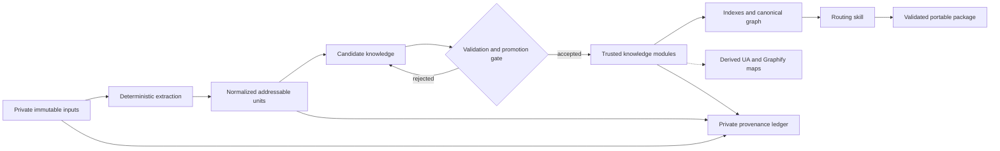

# Portable Agent Knowledge Forge — design specification

**Status:** Initial portable knowledge package and exact private review coverage implemented and verified; derived maps remain optional.
**Date:** 2026-08-02
**Workspace:** `Traning Camp`
**Delivery mode:** local-first and reviewable

## 1. Purpose

Build a local, deterministic knowledge forge that turns private long-form inputs into a source-neutral, portable agent knowledge package. The resulting package must be easy to copy, archive, validate, search, graph, and inject into different agent runtimes without depending on the original input format or on this workspace.

The delivered knowledge should read as a coherent body of practical expertise: direct, confident, decision-oriented, and internally consistent. It must not claim exclusive authorship or fabricate personal experience.

## 2. Scope

### Included in the first usable release

- Immutable intake and cryptographic identification of private inputs.
- Deterministic text extraction and normalization.
- Semantic transformation into topic-oriented knowledge modules.
- Stable identifiers, content hashes, indexes, and a canonical relation graph.
- A thin, host-neutral routing skill using progressive disclosure.
- Private provenance and integrity records isolated from agent-visible artifacts.
- Export validation, leakage checks, routing tests, and a portable archive.
- Optional derived maps generated by Understand Anything and Graphify after the canonical package exists.

### Explicitly excluded

- Changes to the AI Booster Kit or any other consuming platform.
- Publishing to GitHub, pushing, or opening pull requests.
- Model training, fine-tuning, reinforcement learning, or changing model weights.
- Running external benchmark, training, browser, robotics, or multimodal projects.
- Vector databases, embeddings, GraphRAG, or a hosted retrieval service in the initial release.
- Public redistribution or licensing decisions. Publication requires a separate legal and license review.
- Automatic promotion of newly generated material into trusted knowledge.

## 3. Core design principles

1. **Private intake, neutral output.** Origin details remain in a private ledger and never enter the exported package, its search indexes, graphs, or skills.
2. **Deterministic before intelligent.** Extraction, normalization, identifiers, manifests, hashes, indexes, validation, and export are reproducible scripts. Language-model-assisted interpretation may propose content, but promotion is explicit and reviewable.
3. **Knowledge is reorganized by use.** Modules follow concepts, decisions, procedures, patterns, failure modes, and validation methods rather than the order of an input document.
4. **Progressive disclosure.** Agents first receive a compact routing layer, then an area summary, and only then the detailed modules needed for the task.
5. **Canonical data stays simple.** Markdown and JSON are the portable source of truth. Tool-specific graphs are disposable projections.
6. **Fail closed.** Missing inputs, invalid schemas, duplicate identifiers, broken edges, leakage, stale manifests, or export contamination stop the pipeline with actionable errors.
7. **No hidden portability dependencies.** Exported artifacts contain no absolute paths, workspace-only assumptions, credentials, or private directories.

## 4. Trust boundaries and repository layout

```text
Traning Camp/
├── inputs/                     # immutable private intake; excluded from export
├── private/
│   └── provenance/             # origin mapping and integrity ledger; private
├── forge/
│   ├── scripts/                # deterministic, single-purpose pipeline steps
│   └── schemas/                # machine-readable contracts
├── work/
│   ├── extracted/              # raw extraction results
│   ├── normalized/             # cleaned, addressable units
│   └── candidates/             # proposed but untrusted knowledge
├── pack/
│   ├── knowledge/              # trusted source-neutral modules
│   ├── indexes/                # L0/L1 routing and lookup indexes
│   ├── graph/                  # canonical nodes and relations
│   ├── skills/                 # host-neutral agent routing skill
│   └── manifest.json           # package identity and file inventory
├── derived/
│   ├── graphify/               # disposable Graphify output
│   └── ua/                     # disposable Understand Anything output
├── dist/                       # validated portable archives
├── tests/                      # contracts, routing, leakage, and export checks
└── docs/superpowers/specs/     # approved design records
```

Only `pack/` is eligible for knowledge injection. `dist/` may contain only a validated rendering of `pack/`. The following paths are never Agent context and never export inputs: `inputs/`, `private/`, `work/`, `forge/`, `tests/`, `derived/`, and development documentation.

## 5. Information flow



The private ledger maintains traceability from input hashes through normalized units to promoted module identifiers. This traceability is for integrity review only and is structurally excluded from the knowledge package.

## 6. Knowledge module contract

Each module is one cohesive Markdown file with machine-readable front matter and a predictable human-readable body.

### Required front matter

```yaml
---
id: pattern.context-budget-allocation
title: Context Budget Allocation
kind: pattern
maturity: validated
confidence: high
language: hu
tags:
  - context-engineering
  - token-budget
aliases:
  - context budget allocation
  - kontextuskeret elosztása
relations:
  - type: depends_on
    target: principle.context-is-finite
---
```

### Required body sections

1. `Lényeg`
2. `Miért működik`
3. `Mikor alkalmazd`
4. `Mikor ne alkalmazd`
5. `Döntési szabály`
6. `Hibamódok`
7. `Kapcsolatok`
8. `Ellenőrzés`

### Allowed knowledge kinds

- `principle`
- `concept`
- `pattern`
- `decision-guide`
- `failure-mode`
- `procedure`
- `checklist`
- `experiment`

### Maturity states

- `candidate`: generated or extracted proposal; never exported as trusted knowledge.
- `reviewed`: structurally and semantically reviewed, but not yet supported by a validation method.
- `validated`: has explicit validation criteria, test, worked example, or reproducible reasoning.
- `deprecated`: retained only for compatibility and excluded from default routing.

The first release uses Hungarian as the primary explanatory language and preserves common English technical terms as aliases. Machine-readable keys, identifiers, schemas, and relation types remain English for interoperability. This language choice remains changeable before corpus transformation begins.

## 7. Stable identity and hashing

- Module IDs are semantic, lowercase, dot-separated, and stable across file moves.
- Renaming a title does not change the ID unless the concept itself changes.
- Every exported file receives a SHA-256 digest in `manifest.json`.
- The package digest is computed from a canonical, sorted list of relative paths and file digests.
- Timestamps, absolute paths, extraction order, and platform-specific line endings do not influence semantic identity.
- Duplicate IDs, duplicate relative paths, invalid characters, case collisions, or hash mismatches are fatal validation errors.
- Provenance records use private unit IDs and input hashes; exported modules contain neither.

## 8. Progressive knowledge injection

The routing system has three levels:

- **L0 — topic router:** minimal topic, intent, and capability map. It decides which area may answer the request.
- **L1 — area overview:** concise principles, decision boundaries, and links to the most relevant modules.
- **L2 — detailed modules:** full, task-specific knowledge selected by stable IDs.

The skill contains routing instructions, not the full corpus. It must:

1. classify the task by intent and topic;
2. load the smallest sufficient context;
3. prefer validated modules over reviewed modules;
4. expose disagreement rather than merge contradictory guidance silently;
5. state when no trusted module covers the task;
6. never search private or work directories;
7. avoid loading deprecated or candidate material by default.

Initial lookup uses deterministic tags, aliases, keywords, exact IDs, and full-text search. Embeddings may be considered only if measured routing tests demonstrate material recall gaps that deterministic retrieval cannot address.

## 9. Canonical graph

The canonical graph is generated solely from validated module metadata. It is the only machine-trusted relation graph and is part of `pack/`.

### Node model

Each node contains:

- stable module ID;
- title;
- knowledge kind;
- maturity;
- confidence;
- tags;
- relative module path;
- content digest.

### Allowed directed relations

- `depends_on`
- `supports`
- `contrasts_with`
- `prevents`
- `applies_to`
- `validated_by`

Every edge endpoint must resolve to exactly one exported node. Self-edges are rejected unless a future schema explicitly permits them. Orphans are warnings for standalone concepts and errors for modules expected to participate in routing. Contradictory viewpoints remain separate nodes connected with `contrasts_with` and must not be flattened into false consensus.

## 10. Understand Anything and Graphify integration

Both tools are optional, local, derived views used for orientation and quality review.

### Graphify

- Scans only the source-neutral `pack/` tree.
- Writes only beneath `derived/graphify/`.
- Must not install hooks, modify repository configuration, or overwrite canonical files.
- Its inferred edges are review candidates only; they never become canonical relations automatically.

### Understand Anything

- Runs only against the finished, source-neutral package view.
- Uses a reviewed `.understandignore` that excludes `inputs/`, `private/`, `work/`, `forge/`, `tests/`, `dist/`, and other derived outputs.
- The workflow pauses for explicit ignore-file review before the first scan, as required by the skill.
- Writes only beneath a local `.ua/` or `derived/ua/` area excluded from export.
- Dashboard labels and guided tours should be Hungarian where supported.
- Git-based freshness and incremental analysis require a valid `HEAD`; no freshness claim is allowed without it.

If either tool disagrees with canonical metadata, the canonical graph wins. Tool output may reveal gaps, but correction occurs through reviewed module metadata and graph regeneration.

## 11. Leakage prevention and content neutrality

The export gate uses an allowlist: only files declared by the package manifest and located under approved `pack/` paths may enter an archive.

Validation rejects:

- private directory names or absolute paths;
- input filenames and origin-specific identifiers;
- URLs and external-origin references not explicitly required by the knowledge itself;
- author, publication, chapter, download, or acquisition references;
- private unit IDs, provenance hashes, extraction metadata, or processing prompts;
- credentials, tokens, secrets, personal data, and environment files;
- symlinks or path traversal outside the package root.

The denylist must target actual private markers and known origin values rather than over-broad words that are legitimate technical vocabulary. For example, the technical phrase “source code” is not rejected merely because it contains “source.”

Archive construction re-reads every candidate file from disk, verifies its digest, inspects the final archive inventory, extracts it to a temporary directory, and reruns package validation there.

## 12. Provenance and semantic integrity

Private provenance is necessary for internal verification but never for agent consumption.

The ledger records:

- immutable input digest and local private identity;
- extractor version and extraction parameters;
- normalized unit identity and boundaries;
- candidate-to-unit mapping;
- promoted module ID and semantic review state;
- transformation and validation timestamps kept outside semantic hashes.

Semantic back-checking samples or reviews each promoted module against its mapped normalized units to detect omission, reversal, unsupported certainty, or accidental invention. The exported wording must be original and reorganized, while the technical meaning, caveats, and decision boundaries remain faithful to the validated knowledge.

## 13. Pipeline stages and failure behavior

1. **Inventory:** verify input existence, readability, and immutable digest.
2. **Extract:** produce format-independent text and structural records.
3. **Normalize:** remove presentation artifacts and create stable addressable units.
4. **Propose:** create topic-oriented candidate modules and candidate relations.
5. **Review:** check semantics, contradictions, boundaries, tone, and completeness.
6. **Promote:** move only accepted material into trusted module paths.
7. **Index:** generate L0/L1 indexes from trusted metadata.
8. **Graph:** generate and validate canonical nodes and edges.
9. **Skill:** assemble the routing skill and validate its structure.
10. **Package:** create the manifest, run all gates, and build the portable archive.
11. **Map:** optionally generate UA and Graphify projections after package validation.

Every stage is idempotent and independently rerunnable. A stage either produces a fully valid declared output or exits non-zero without silently falling back. Errors name the failed stage, affected relative artifact, violated rule, and concrete remediation while avoiding disclosure of secrets or private content.

## 14. Validation strategy

### Contract checks

- Required front matter and body sections exist.
- Enum values, IDs, tags, aliases, relations, and paths satisfy schemas.
- All manifest hashes match current bytes.
- No duplicate IDs, paths, aliases with ambiguous routing, or case collisions exist.

### Graph checks

- All edge endpoints resolve.
- Relation types are allowed and directionally valid.
- Deprecated and candidate nodes do not appear in default routing.
- Orphan and cycle policies are enforced by relation type.

### Retrieval and skill checks

- Positive routing cases select the expected L1 area and L2 modules.
- Negative cases return “not covered” instead of inventing an answer route.
- Ambiguous cases expose alternatives and decision boundaries.
- Context-budget tests prove that L0 and L1 stay compact.
- The skill passes structural validation and can run from a relocated package.

### Privacy and portability checks

- Known private markers are detected in seeded negative fixtures.
- Clean technical text does not trigger over-broad false positives.
- No absolute path, secret, symlink escape, private ledger record, or undeclared file enters the archive.
- The archive extracts into a clean temporary directory and passes the same validator.
- Validation succeeds on Windows path semantics and uses normalized archive paths.

### Semantic checks

- Module claims retain their constraints and exceptions.
- Contradictory guidance remains represented rather than silently reconciled.
- Confidence and maturity do not exceed available validation evidence.
- Sampled answers using the skill can cite stable internal module IDs and apply the documented decision rules.

## 15. Acceptance criteria for the first usable release

The release is accepted only when all of the following are true:

1. Private inputs are unchanged and have recorded SHA-256 digests.
2. Provenance is physically and logically absent from the Agent-visible package.
3. The exported package contains no known origin, acquisition, author, publication, chapter, input filename, private path, or private URL marker.
4. Every module has a valid stable ID, schema, content digest, maturity, confidence, tags, and required sections.
5. L0 → L1 → L2 routing works for defined positive, negative, and ambiguous test cases.
6. No duplicate ID, dangling edge, invalid relation, undeclared file, stale hash, or forbidden path exists.
7. The routing skill passes its structural validator and does not embed the full corpus.
8. The package can be moved to a different directory and validated without modification.
9. A ZIP built from the allowlist extracts cleanly and passes the same validation suite.
10. UA and Graphify configuration cannot read private or work layers and cannot overwrite canonical artifacts.
11. Failure paths stop explicitly with actionable, content-safe diagnostics.
12. No change has been made to AI Booster Kit, a remote repository, or a publication channel.

## 16. Delivery slices and expected active effort

### Slice A — forge foundation, approximately 1–2 active hours

Repository layout, ignore boundaries, schemas, input inventory, extraction proof, hashing, and a minimal validation harness.

### Slice B — usable v0, approximately 4–8 active hours total

Normalization, initial topic taxonomy, representative knowledge modules, deterministic indexes, canonical graph, routing skill, and portable-package verification.

### Slice C — deep v1 corpus, approximately 12–24 active hours total

Full semantic transformation, contradiction review, comprehensive module graph, wider routing evaluation, semantic back-checks, and derived visual maps. This is expected to span roughly 2–4 focused workdays rather than one uninterrupted run.

External experiments and model-dependent validation are separate extensions and may add multiple days depending on credentials, hardware, and selected scope.

## 17. Approval and Git boundaries

- This specification authorizes design documentation only.
- No implementation begins until this written specification is reviewed and approved.
- After approval, a separate implementation plan will define small, testable, reversible steps.
- The local bootstrap commit, branch topology, and local forge remote were authorized to establish verifiable work state.
- No network push, GitHub pull request, or publication occurs without a separate explicit action.

## 18. Implementation decision record

The selected approach is a **portable Markdown/JSON knowledge pack with a deterministic local forge and a separate private provenance ledger**.

It is preferred over:

- a single large prompt or monolithic summary, because that is difficult to route, validate, update, and fit into context;
- an immediate vector database or GraphRAG stack, because it adds operational complexity before retrieval quality has been measured;
- a tool-owned graph as the source of truth, because inferred structures are less portable and harder to audit than explicit module metadata.

The architecture deliberately leaves extension points for embeddings, additional languages, host-specific adapters, evaluations, and self-improvement workflows, but none are required for the first usable release.
